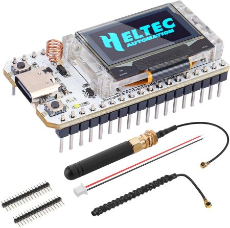

# Meshtastic Journey
Stumbled across [Meshtastic](https://www.meshtastic.org) and thought it looked like something fun to explore.
# NodeRed
## NodeRed on a VPS
I picked up a cheap VPS and one of the docker images I am running is NodeRed.     Been having a lot of fun writing simple automations.    I run a private mqtt broker on the same VPS and send messages from my home Meshtastic node to my private broker.
### Commands 
* Respond to "ping" with a broadcast reply on the number of hops away the sending node is
* Respond to "test" with a direct reply with the number of hops away
## NodeRed on a PI
I am also running NR on a [Raspberry PI Zero 2W](https://www.raspberrypi.com/products/raspberry-pi-zero-2-w/) and the [NodeRed Messages node](https://meshtastic.org/docs/community/software/community-node-red-messages/) module.   Still a WIP but using a local node I have more control over sending and receiving packets then via the built in mqtt.    I still send the messages to my private broker for processing.

# Hardware
## [Heltec v2](https://heltec.org/project/wifi-lora-32v2/)
> [!Warning]
> You probably don't want to buy these.  Watch out for cheap Heltec v2s on Ali or Amazon.  The v2 is discontinued (for good reasons) and repaced by the v3.
The Heltec v2 is no longer supported by the Meshtastic flasher.      I ended up buying one of these by mistake (< $20CDN on Ali), but do have it working.    In order to flah the v2 you need to compile the firmware yourself.
### Flashing a V2
Flashing a v2 requies you to compile your own firmware.     Here is the steps I followed:
* Open a Gitpod Cloud environment (uses your github account) -  [https://gitpod.io/#https://github.com/meshtastic/firmware](https://gitpod.io/#https://github.com/meshtastic/firmware)
* You will need to accept the defaults to fork the meshtastic firmware
* Click the Source Control icon on the left hand sidebar (or hit Ctrl-Shift-G)
* Click the "devel" or "master" next to firmware and scroll down to the version of firmware to compile
* In the terminal at the bottom enter the command based on your board version:
  * Heltec V2: pio run -e heltec-v2_0
  * Heltec V2.1: pio run -e heltec-v2_1
* Once the build has finished go to "Explorer" tab on the left (Ctrl-shift-E)
  * Go to the folder .pio/build/heltec-v2_X/
  * Find firmware.factory.bin 
  * Right click and select Download
* Use the generic web flasher [https://esptool.spacehuhn.com/](https://esptool.spacehuhn.com/) to flash your bin

Alternativley:
* Grab an older bin from [https://github.com/richblackhat/meshtastic-vintage/tree/main/firmware-2.5.4](https://github.com/richblackhat/meshtastic-vintage/tree/main/firmware-2.5.4)

> Adapted from [https://www.reddit.com/r/meshtastic/comments/1hrancs/guide_heltec_v2v21_build_latest_meshtastic/](https://www.reddit.com/r/meshtastic/comments/1hrancs/guide_heltec_v2v21_build_latest_meshtastic/)

## [Heltec v3](https://heltec.org/project/wifi-lora-32-v3/)

Picked mine up on [Amazon](https://www.amazon.ca/dp/B0D7HSHTNX?tag=simsay02-20) for $35CDN.   I have one in a portable node with a 3000ma battery and another powered via USB at the house. 

## [XIAO nRF52840 & Wio-SX1262](https://www.seeedstudio.com/XIAO-nRF52840-Wio-SX1262-Kit-for-Meshtastic-p-6400.html)

Got one on the way from [Aliexpress for < $20CDN](https://www.aliexpress.com/item/1005008760784706.html). These are *much* lower power then the ESP32 based noted so better suited for solar. 

## Antennas

I have bought a couple of these [patch antennas](https://www.aliexpress.com/item/1005007198233419.html) on Ali for < $6CDN.

## Solar Nodes

* I ordered a [solar light from Aliexpress](https://www.aliexpress.com/item/1005008035585251.html) (~$10) that supposedly has a large enough battery to keep a node running.   My plan is to disassemble and install a XXX.
* Will update when complete.

# 3D Printed Cases
Recommend these cases...
*  [Muzi case for Heltec v3](https://makerworld.com/en/models/160873-h1-case-for-heltec-v3-running-meshtastic)
*  [Remix for larger battery](https://makerworld.com/en/models/591051-h1-big-case-for-heltec-v3-running-meshtastic)
*  [Desktop style case](https://www.printables.com/model/797822-bender-battery-case-for-the-heltec-v3-heltec-t114)
